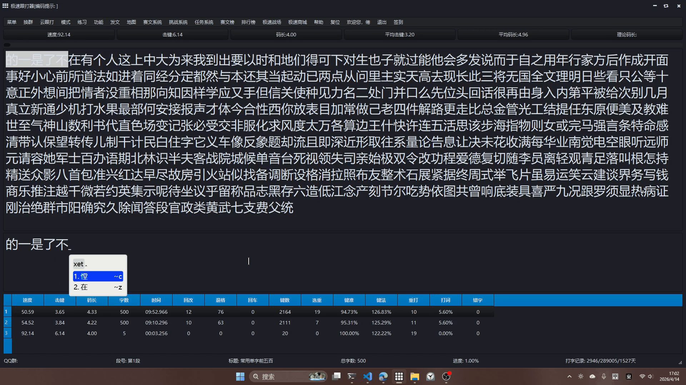

# Rime 三码四码混合输入自动切分

基于 Rime 输入法框架的自定义脚本，实现三码字和四码字混合编码的智能切分，减少空格键输入,本示例中的码表是米十五笔的全单字码表,不过该方案适用于仅有三码和四码的输入方案,也可以修改下用于其它码长的输入方案.
当前配置只是开发验证使用,为最简配置,无法满足日常使用,想要使用应将脚本附加到已配置好的rime方案中.

## 功能特性

- **自动切分上屏**：根据编码成字情况自动推断用户意图，减少手动选字
- **候选提示**：长编码时显示前三码/前四码候选供用户手动选择
- **循环处理**：连续上屏后自动处理剩余编码，一次按键触发多字上屏

## 效果示例

演示过程中有刻意没有主动输入空格，只有在无法切分的部分（即输入超过两个字后仍无法自动上屏首字时）才进行手动选字。



## 文件结构

```
Rime/
├── lua/
│   ├── auto_commit.lua      # Processor - 自动上屏切分逻辑
│   ├── my_translate.lua     # Translator - 长编码候选提示
│   ├── utf8_sub.lua       # UTF-8 字符串截取工具
├── mishi_wubi.schema.yaml      # 输入方案配置
├── mishi_wubi.dict.yaml       # 词典文件
└── rime.lua             # Lua 脚本入口
```

## 切分逻辑

| 码长 | 条件 | 操作 |
|------|------|------|
| 4码 | 三码成字 + 四码不成字 | 上屏三码字 |
| 5码 | 仅四码成字 | 上屏四码字 |
| 7码 | 末4码 + 末3码都不成字,则首字只能是四码 | 上屏前四码字 |
| 8码 | 末4码 + 末3码都不成字,则首字只能是三码 | 上屏前三码字 |

## 安装使用

1. 将 `lua/` 目录和配置文件复制到 Rime 用户目录
2. 在 schema 配置中启用脚本：

```yaml
engine:
  processors:
    - lua_processor@auto_commit
    # ...其他 processors
  translators:
    - lua_translator@my_translate
    # ...其他 translators
```

3. 重新部署 Rime

## 适用场景

- 码表仅包含三码字和四码字
- 支持连续输入时的智能切分
- 减少空格/选字键输入次数

## 许可证

MIT License